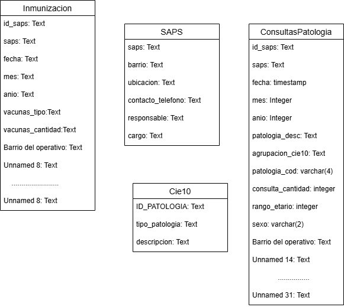
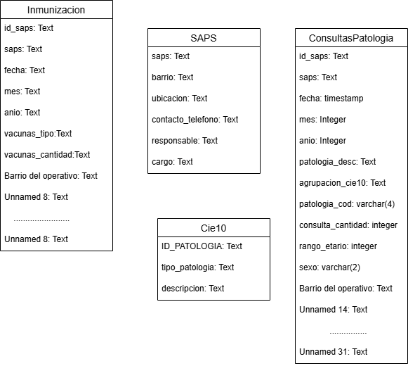
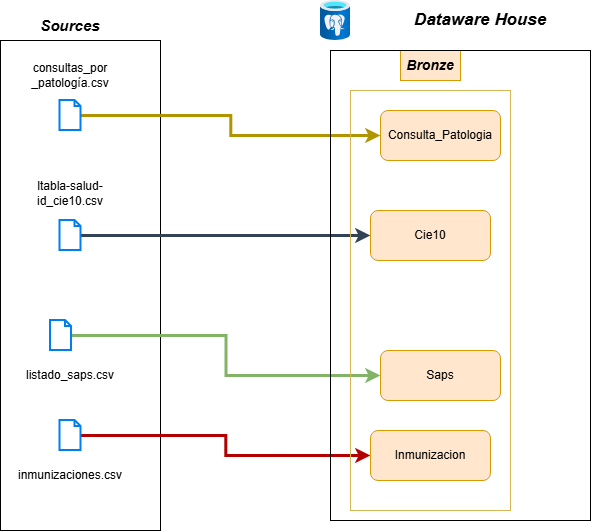
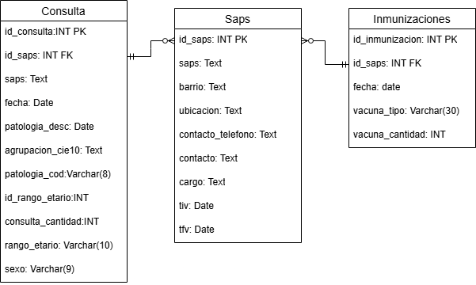
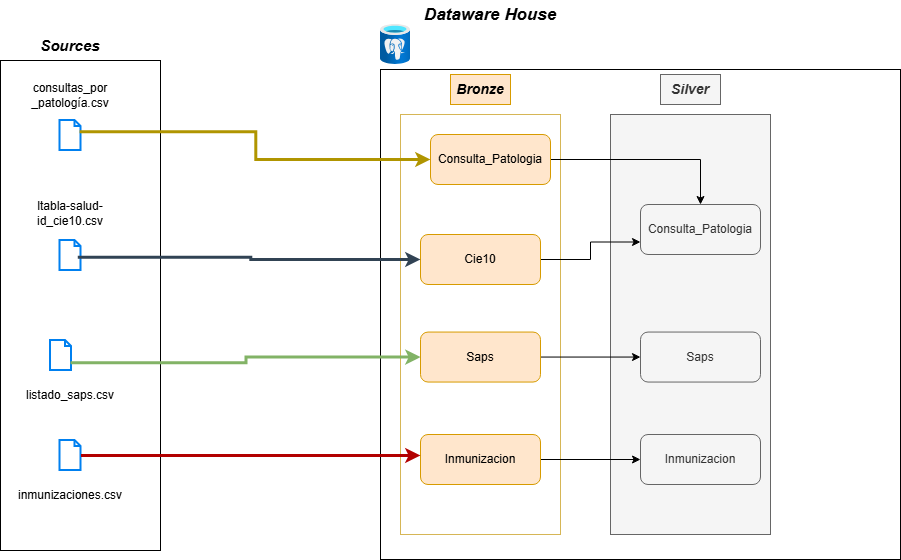
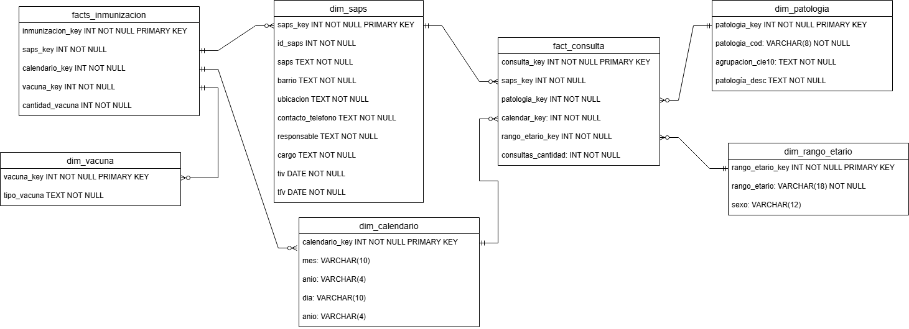
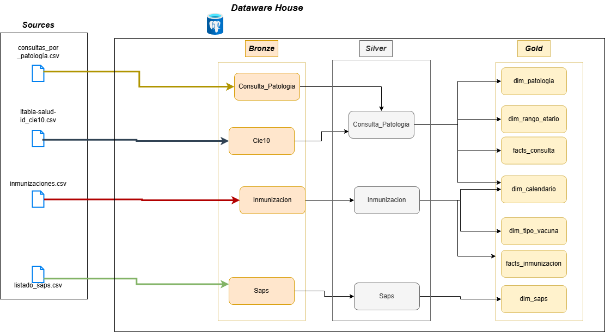

# 🏥📊 Dataware House Para Servicios De Salud CAPS-Corrientes, Capital

---

## 📑 Contenido

- 📌 **1. Introducción del Proyecto**
  - 1.1 Breve Explicación  
  - 1.2 Objetivo del Proyecto
- 🛠️ **2. Herramientas Utilizadas**
- 🗂️ **3. Estructura Inicial de los Datos**
- 📈 **4. KPI y Preguntas a Responder**
- 🧱 **5. Estructura de las Capas**
  - 5.1 Capa de Bronce  
  - 5.1.1 Prelimpieza de Datos con Python  
  - 5.2 Capa de Plata  
  - 5.3 Capa de Oro
- 🔗 **Referencias**

---

## 📌 1. Introducción Del Proyecto

 El proyecto se centra en tomar los datos que se encuentran disponibles en el sitio de datos abiertos
 de la provincia de Corrientes, Argentina con la finalidad de crear un dataware house para la posterior consulta con herramientas BI para el análisis estadístico de estos datos.
 Para este proyecto, se tomaron los datos de las atenciones por patologías realizadas en los Servicios de Atención Primaria De Salud (SAPS) ubicados en la provincia de Corrientes, en la capital de la misma. Además, se agregó la información de las inmunizaciones realizadas en los SAPS de la misma provincia y localidad.
 
 ---

### 📝 1.1 Breve Explicación

 Tomaremos los datos de las atenciones médicas por patologías e inmunizaciones realizadas en los SAPS de Corrientes Capital, Argentina. De esta forma, podremos obtener datos estadísticos sobre la cantidad de patologías atendidas, los tipos de patologías, los centros donde se realizaron estas atenciones, el sexo de los pacientes, el rango etario de los mismos, los tipos de vacunas administradas y su cantidad. 
 Los datos de las cantidades de atenciones podrán consultarse por patología, saps, rango etario, evolución a través del tiempo, etc. Así como los datos de cantidades de inmunizaciones también podrán consultarse por saps, rango etario, evolución a través del tiempo o por tipo de vacuna aplicada.

---

### 🎯 1.2 Objetivo Del Proyecto

El objetivo del proyecto es lograr un **Dataware House** con una capa que contenga  un **modelo en estrella** de los datos para mejorar la eficiencia en las consultas.  
De esta manera, se podrá obtener información significativa sobre¡las atenciones e inmunizaciones. Esperamos que esto pueda facilitar la toma de decisiones informadas que ayuden a mejorar los servicios de salud.

---

## 🛠️ 2. Herramientas Utilizadas

Para el desarrollo del proyecto se emplean las siguientes herramientas:

- 🐍 **Python**: Extracción, limpieza y visualización de datos.  
- 🐘 **PostgreSQL**: Extracción, transformación y carga de datos. Creación de capas del Dataware House.  
- 📐 **PlantUML**: Modelado de datos.  
- 🧩 **Draw.io**: Diagramas de capas y flujos de datos.  
- 📋 **Trello**: Gestión de tareas y planificación del proyecto.  
- 📊 **Metabase**: Visualización de datos.

---

## 🗂️ 3-Estructura inicial de los datos 

Tabla: Consultas Según Palogía Médica. Datos Abiertos Ciudad De Corrientes

<table style="width:100%; border-collapse:collapse; font-family:Arial, Helvetica, sans-serif;">
    <thead>
        <tr>
            <th style="background:#00a3e0; color:#fff; border:3px solid #000; padding:12px;">
                Título de la columna
            </th>
            <th style="background:#00a3e0; color:#fff; border:3px solid #000; padding:12px;">
                Tipo de dato
            </th>
            <th style="background:#00a3e0; color:#fff; border:3px solid #000; padding:12px;">
                Descripción
            </th>
        </tr>
    </thead>
    <tbody>
        <tr style="background:#eaf7fd;">
            <td style="border:3px solid #000; padding:10px; text-align:center;">saps</td>
            <td style="border:3px solid #000; padding:10px; text-align:center;">Texto (string)</td>
            <td style="border:3px solid #000; padding:10px; text-align:center;">Nombre del SAPS</td>
        </tr>
         <tr>
            <td style="border:3px solid #000; padding:10px; text-align:center;">fecha</td>
            <td style="border:3px solid #000; padding:10px; text-align:center;">Fecha ISO-8601 (date)</td>
            <td style="border:3px solid #000; padding:10px; text-align:center;">Periodo de la consulta médica</td>
        </tr>
          <tr>
            <td style="border:3px solid #000; padding:10px; text-align:center;">mes</td>
            <td style="border:3px solid #000; padding:10px; text-align:center;">Entero</td>
            <td style="border:3px solid #000; padding:10px; text-align:center;">mes de la consulta médica</td>
        </tr>
         <tr>
            <td style="border:3px solid #000; padding:10px; text-align:center;">anio</td>
            <td style="border:3px solid #000; padding:10px; text-align:center;">Entero</td>
            <td style="border:3px solid #000; padding:10px; text-align:center;">Anio de la consulta médica</td>
        </tr>
        <tr style="background:#eaf7fd;">
            <td style="border:3px solid #000; padding:10px; text-align:center;">patologia_desc</td>
            <td style="border:3px solid #000; padding:10px; text-align:center;">Texto (string)</td>
            <td style="border:3px solid #000; padding:10px; text-align:center;">Descripción de la patología</td>
        </tr>
        <tr>
            <td style="border:3px solid #000; padding:10px; text-align:center;">agrupacion_cie10</td>
            <td style="border:3px solid #000; padding:10px; text-align:center;">Texto (string)</td>
            <td style="border:3px solid #000; padding:10px; text-align:center;">Grupo según nomenclador CIE-10</td>
        </tr>
        <tr style="background:#eaf7fd;">
            <td style="border:3px solid #000; padding:10px; text-align:center;">patologia_cod</td>
            <td style="border:3px solid #000; padding:10px; text-align:center;">Texto (string)</td>
            <td style="border:3px solid #000; padding:10px; text-align:center;">Código CIE-10</td>
        </tr>
        <tr>
            <td style="border:3px solid #000; padding:10px; text-align:center;">consulta_cantidad</td>
            <td style="border:3px solid #000; padding:10px; text-align:center;">Número entero (integer)</td>
            <td style="border:3px solid #000; padding:10px; text-align:center;">Cantidad de consultas médicas</td>
        </tr>
        <tr style="background:#eaf7fd;">
            <td style="border:3px solid #000; padding:10px; text-align:center;">rango_etario</td>
            <td style="border:3px solid #000; padding:10px; text-align:center;">Texto</td>
            <td style="border:3px solid #000; padding:10px; text-align:center;">Rango etario de pacientes</td>
        </tr>
        <tr>
            <td style="border:3px solid #000; padding:10px; text-align:center;">sexo</td>
            <td style="border:3px solid #000; padding:10px; text-align:center;">Texto (string)</td>
            <td style="border:3px solid #000; padding:10px; text-align:center;">Sexo del paciente</td>
        </tr>
          <tr>
            <td style="border:3px solid #000; padding:10px; text-align:center;">Barrio del operativo</td>
            <td style="border:3px solid #000; padding:10px; text-align:center;">Texto (string)</td>
            <td style="border:3px solid #000; padding:10px; text-align:center;">Si es un operativo territorial, representa el barrio donde se realizó la consulta</td>
        </tr>
    </tbody>
</table>

Tabla: Nomenclador CIE-10. Datos Abiertos Ciudad De Corrientes

<table style="width:100%; border-collapse:collapse; font-family:Arial, Helvetica, sans-serif;">
    <thead>
        <tr>
            <th style="background:#00a3e0; color:#fff; border:3px solid #000; padding:12px;">
                Título de la columna
            </th>
            <th style="background:#00a3e0; color:#fff; border:3px solid #000; padding:12px;">
                Tipo de dato
            </th>
            <th style="background:#00a3e0; color:#fff; border:3px solid #000; padding:12px;">
                Descripción
            </th>
        </tr>
    </thead>
    <tbody>
        <tr style="background:#eaf7fd;">
            <td style="border:3px solid #000; padding:10px; text-align:center;">ID_Patologia</td>
            <td style="border:3px solid #000; padding:10px; text-align:center;">Texto (string)</td>
            <td style="border:3px solid #000; padding:10px; text-align:center;">El código de identificación de la patología</td>
        </tr>
        <tr style="background:#eaf7fd;">
            <td style="border:3px solid #000; padding:10px; text-align:center;">tipo_patología</td>
            <td style="border:3px solid #000; padding:10px; text-align:center;">Texto (string)</td>
            <td style="border:3px solid #000; padding:10px; text-align:center;">El nombre o descripción con el que se identifica a la patología</td>
        </tr>
        <tr>
            <td style="border:3px solid #000; padding:10px; text-align:center;">Descripción</td>
            <td style="border:3px solid #000; padding:10px; text-align:center;">Texto (string)</td>
            <td style="border:3px solid #000; padding:10px; text-align:center;">Descripción más detallada de la patología</td>
        </tr>
    </tbody>
</table>

Tabla: Inmunizaciones. Datos Abiertos Ciudad De Corrientes

<table style="width:100%; border-collapse:collapse; font-family:Arial, Helvetica, sans-serif;">
    <thead>
        <tr>
            <th style="background:#00a3e0; color:#fff; border:3px solid #000; padding:12px;">
                Título de la columna
            </th>
            <th style="background:#00a3e0; color:#fff; border:3px solid #000; padding:12px;">
                Tipo de dato
            </th>
            <th style="background:#00a3e0; color:#fff; border:3px solid #000; padding:12px;">
                Descripción
            </th>
        </tr>
    </thead>
    <tbody>
        <tr style="background:#eaf7fd;">
            <td style="border:3px solid #000; padding:10px; text-align:center;">id_saps</td>
            <td style="border:3px solid #000; padding:10px; text-align:center;">Texto (string)</td>
            <td style="border:3px solid #000; padding:10px; text-align:center;">Indica el identificador del saps</td>
        </tr>
        <tr style="background:#eaf7fd;">
            <td style="border:3px solid #000; padding:10px; text-align:center;">saps</td>
            <td style="border:3px solid #000; padding:10px; text-align:center;">Texto (string)</td>
            <td style="border:3px solid #000; padding:10px; text-align:center;">Nombre del saps donde se administró la vacuna</td>
        </tr>
        <tr style="background:#eaf7fd;">
            <td style="border:3px solid #000; padding:10px; text-align:center;">fecha</td>
            <td style="border:3px solid #000; padding:10px; text-align:center;">Fecha ISO-8601 (date)</td>
            <td style="border:3px solid #000; padding:10px; text-align:center;">Periodo de la consulta médica.</td>
        </tr>
         <tr style="background:#eaf7fd;">
            <td style="border:3px solid #000; padding:10px; text-align:center;">mes</td>
            <td style="border:3px solid #000; padding:10px; text-align:center;">Text</td>
            <td style="border:3px solid #000; padding:10px; text-align:center;">Mes del Periodo de la consulta médica.</td>
        </tr>
         <tr style="background:#eaf7fd;">
            <td style="border:3px solid #000; padding:10px; text-align:center;">anio</td>
            <td style="border:3px solid #000; padding:10px; text-align:center;">Text</td>
            <td style="border:3px solid #000; padding:10px; text-align:center;">Año Periodo de la consulta médica.</td>
        </tr>
        <tr>
            <td style="border:3px solid #000; padding:10px; text-align:center;">vacunas_tipo </td>
            <td style="border:3px solid #000; padding:10px; text-align:center;">Texto (string)</td>
            <td style="border:3px solid #000; padding:10px; text-align:center;">Tipo de vacuna aplicada</td>
        </tr>
        <tr>
            <td style="border:3px solid #000; padding:10px; text-align:center;">vacunas_cantidad </td>
            <td style="border:3px solid #000; padding:10px; text-align:center;">Número entero (integer)</td>
            <td style="border:3px solid #000; padding:10px; text-align:center;">Cantidad de vacunas efectuadas </td>
        </tr>
        <tr>
            <td style="border:3px solid #000; padding:10px; text-align:center;">Barrio del operativo </td>
            <td style="border:3px solid #000; padding:10px; text-align:center;">Texto</td>
            <td style="border:3px solid #000; padding:10px; text-align:center;">Si se trata de un operativo territorial, indica el barrio donde se realizó. </td>
        </tr>
    </tbody>
</table>

Tabla: Listado De SAPS. Datos Abiertos Ciudad De Corrientes

<table style="width:100%; border-collapse:collapse; font-family:Arial, Helvetica, sans-serif;">
    <thead>
        <tr>
            <th style="background:#00a3e0; color:#fff; border:3px solid #000; padding:12px;">
                Título de la columna
            </th>
            <th style="background:#00a3e0; color:#fff; border:3px solid #000; padding:12px;">
                Tipo de dato
            </th>
            <th style="background:#00a3e0; color:#fff; border:3px solid #000; padding:12px;">
                Descripción
            </th>
        </tr>
    </thead>
    <tbody>
        <tr style="background:#eaf7fd;">
            <td style="border:3px solid #000; padding:10px; text-align:center;">SAPS</td>
            <td style="border:3px solid #000; padding:10px; text-align:center;">Texto (string)</td>
            <td style="border:3px solid #000; padding:10px; text-align:center;">El nombre del SAPS</td>
        </tr>
        <tr style="background:#eaf7fd;">
            <td style="border:3px solid #000; padding:10px; text-align:center;">Barrio</td>
            <td style="border:3px solid #000; padding:10px; text-align:center;">Texto (string)</td>
            <td style="border:3px solid #000; padding:10px; text-align:center;">El nombre del barrio donde se encuentra ubicado el SAPS</td>
        </tr>
        <tr>
            <td style="border:3px solid #000; padding:10px; text-align:center;">Ubicación</td>
            <td style="border:3px solid #000; padding:10px; text-align:center;">Texto (string)</td>
            <td style="border:3px solid #000; padding:10px; text-align:center;">El nombre de las calles donde se encuentra el SAPS</td>
        </tr>
         <tr>
            <td style="border:3px solid #000; padding:10px; text-align:center;">contacto_telefono</td>
            <td style="border:3px solid #000; padding:10px; text-align:center;">Texto (string)</td>
            <td style="border:3px solid #000; padding:10px; text-align:center;">El teléfono para comunicarse con el SAPS</td>
        </tr>
          <tr>
            <td style="border:3px solid #000; padding:10px; text-align:center;">responsable</td>
            <td style="border:3px solid #000; padding:10px; text-align:center;">Texto (string)</td>
            <td style="border:3px solid #000; padding:10px; text-align:center;">Nombre y apellido de la persona responsable del SAPS</td>
        </tr>
          <tr>
            <td style="border:3px solid #000; padding:10px; text-align:center;">cargo</td>
            <td style="border:3px solid #000; padding:10px; text-align:center;">Texto (string)</td>
            <td style="border:3px solid #000; padding:10px; text-align:center;">El cargo de la persona responsable</td>
        </tr>
    </tbody>
</table>

Existen varias columnas que se trae desde el archivo csv, pero que se notan son columnas que no traen información relevante. Parecen más columnas remanente. Como la teoría reza que debemos mantener los datos sin modificar cuando se carga a la capa de bronce, pero hay que tener en cuenta que estas columnas deben ser descartada al pasar desde bronce a plata.

---

<figure role="group" id="ilust-32">
    
    <figcaption style="text-align:center">
        Imagen 1. Esquema de los archivos csv
    </figcaption>
</figure>

---

## 📈 4-KPI y Preguntas

Las siguiente métricas pueden ser analizadas con los datos que tenemos

Las siguientes métricas pueden ser analizadas con los datos disponibles:

- 📅 Variación del total de consultas por año, año-mes y año-mes-día.  
- 🦠 Código CIE-10 con mayor cantidad de consultas.  
- 🏥 Distribución de consultas por SAPS.  
- 🚻 Distribución de patologías según sexo.  
- 💉 Tipo de vacuna con mayor cantidad de administraciones.  
- ⏱️ Evolución de las inmunizaciones a lo largo del tiempo.  
- 📊 Distribución de vacunaciones por tipo de vacuna y SAPS.  
- 🏆 SAPS con mayor cantidad de vacunas administradas.

---

## 🧱 5-Estructura De Las Capas

### 🥉 5.1-Capa De Bronce

El esquema para las tablas en la capa de bronce será el mismo que para el csv original. Esto lo hacemos así para mantener exactamente los datos que nos trae desde el archivo csv descargado. Sin embargo, hemos eliminado una columna que proviene del archivo de inmunizaciones: "En caso de ser Operativo Territorial Indicar el Barrio en columna H". Esta columna nos parece más descriptiva, así que la hemos eliminado directamente porque creemos que no aporta información relevante. Las demás columnas las mantenemos.
Además, no realizamos ninguna relación entre las tablas en este punto.

NOTA: Las columnas se mantienen por una cuestión de seguir la teoría. En la capa de bronce los datos deberían ser cargados exactamente como vienen de la fuente por una cuestión de auditoria y seguimiento, en caso de que la fuente original ya no estuviera disponible. Pero, es importante señalar que las columnas catalogadas como Unnamed, parecen ser columnas basura y se puede replantear el hecho de eliminarlas ya desde la capa bronce.

<figure>
    
    <figcaption style="text-align:center">
        Imagen 2. Esquema de tablas para la capa de bronce
    </figcaption>
</figure>

Tabla Con Los Datos De Las Consultas Por Patología

<table style="width:100%; border-collapse:collapse; font-family:Arial, Helvetica, sans-serif;">
    <thead>
        <tr>
            <th style="background:#00a3e0; color:#fff; border:3px solid #000; padding:12px;">
                Título de la columna
            </th>
            <th style="background:#00a3e0; color:#fff; border:3px solid #000; padding:12px;">
                Tipo de dato
            </th>
            <th style="background:#00a3e0; color:#fff; border:3px solid #000; padding:12px;">
                Descripción
            </th>
        </tr>
    </thead>
    <tbody>
        <tr style="background:#eaf7fd;">
            <td style="border:3px solid #000; padding:10px; text-align:center;">Número entero</td>
            <td style="border:3px solid #000; padding:10px; text-align:center;">Un identificador entero único para cada consulta</td>
        </tr>
         <tr style="background:#eaf7fd;">
            <td style="border:3px solid #000; padding:10px; text-align:center;">id_saps</td>
            <td style="border:3px solid #000; padding:10px; text-align:center;">Número entero</td>
            <td style="border:3px solid #000; padding:10px; text-align:center;">Un identificador entero para obtener vincular con la tabla de saps y obtener los datos adicionales para estos últimos.</td>
        </tr>
        <tr style="background:#eaf7fd;">
            <td style="border:3px solid #000; padding:10px; text-align:center;">saps</td>
            <td style="border:3px solid #000; padding:10px; text-align:center;">Texto (string)</td>
            <td style="border:3px solid #000; padding:10px; text-align:center;">Nombre del SAPS</td>
        </tr>
        <tr>
            <td style="border:3px solid #000; padding:10px; text-align:center;">fecha</td>
            <td style="border:3px solid #000; padding:10px; text-align:center;">Fecha ISO-8601 (date)</td>
            <td style="border:3px solid #000; padding:10px; text-align:center;">Periodo de la consulta médica</td>
        </tr>
        <tr>
            <td style="border:3px solid #000; padding:10px; text-align:center;">mes</td>
            <td style="border:3px solid #000; padding:10px; text-align:center;">Entero</td>
            <td style="border:3px solid #000; padding:10px; text-align:center;">Mes del periodo de la consulta médica</td>
        </tr>
         <tr>
            <td style="border:3px solid #000; padding:10px; text-align:center;">anio</td>
            <td style="border:3px solid #000; padding:10px; text-align:center;">Entero</td>
            <td style="border:3px solid #000; padding:10px; text-align:center;">Año del periodo de la consulta médica</td>
        </tr>
        <tr style="background:#eaf7fd;">
            <td style="border:3px solid #000; padding:10px; text-align:center;">patologia_desc</td>
            <td style="border:3px solid #000; padding:10px; text-align:center;">Texto (string)</td>
            <td style="border:3px solid #000; padding:10px; text-align:center;">Descripción de la patología</td>
        </tr>
        <tr>
            <td style="border:3px solid #000; padding:10px; text-align:center;">agrupacion_cie10</td>
            <td style="border:3px solid #000; padding:10px; text-align:center;">Texto (string)</td>
            <td style="border:3px solid #000; padding:10px; text-align:center;">Grupo según nomenclador CIE-10</td>
        </tr>
        <tr style="background:#eaf7fd;">
            <td style="border:3px solid #000; padding:10px; text-align:center;">patologia_cod</td>
            <td style="border:3px solid #000; padding:10px; text-align:center;">Texto (string)</td>
            <td style="border:3px solid #000; padding:10px; text-align:center;">Código CIE-10</td>
        </tr>
        <tr>
            <td style="border:3px solid #000; padding:10px; text-align:center;">consulta_cantidad</td>
            <td style="border:3px solid #000; padding:10px; text-align:center;">Número entero (integer)</td>
            <td style="border:3px solid #000; padding:10px; text-align:center;">Cantidad de consultas médicas</td>
        </tr>
        <tr style="background:#eaf7fd;">
            <td style="border:3px solid #000; padding:10px; text-align:center;">rango_etario</td>
            <td style="border:3px solid #000; padding:10px; text-align:center;">Texto</td>
            <td style="border:3px solid #000; padding:10px; text-align:center;">Rango etario de pacientes</td>
        </tr>
        <tr>
            <td style="border:3px solid #000; padding:10px; text-align:center;">sexo</td>
            <td style="border:3px solid #000; padding:10px; text-align:center;">Texto (string)</td>
            <td style="border:3px solid #000; padding:10px; text-align:center;">Sexo del paciente</td>
        </tr>
        <tr>
            <td style="border:3px solid #000; padding:10px; text-align:center;">Barrio del operativo</td>
            <td style="border:3px solid #000; padding:10px; text-align:center;">Texto (string)</td>
            <td style="border:3px solid #000; padding:10px; text-align:center;">Si es un operativo territorial, indica en qué barrio se realizó</td>
        </tr>
    </tbody>
</table>

Tabla Con Los Datos Para Las Inmunizaciones.

<table style="width:100%; border-collapse:collapse; font-family:Arial, Helvetica, sans-serif;">
    <thead>
        <tr>
            <th style="background:#00a3e0; color:#fff; border:3px solid #000; padding:12px;">
                Título de la columna
            </th>
            <th style="background:#00a3e0; color:#fff; border:3px solid #000; padding:12px;">
                Tipo de dato
            </th>
            <th style="background:#00a3e0; color:#fff; border:3px solid #000; padding:12px;">
                Descripción
            </th>
        </tr>
    </thead>
    <tbody>
        <tr style="background:#eaf7fd;">
            <td style="border:3px solid #000; padding:10px; text-align:center;">id_saps</td>
            <td style="border:3px solid #000; padding:10px; text-align:center;">Número entero</td>
            <td style="border:3px solid #000; padding:10px; text-align:center;">Número de entero que identifica en cuál saps se administró la vacuna</td>
        </tr>
        <tr style="background:#eaf7fd;">
            <td style="border:3px solid #000; padding:10px; text-align:center;">fecha</td>
            <td style="border:3px solid #000; padding:10px; text-align:center;">Fecha ISO-8601 (date)</td>
            <td style="border:3px solid #000; padding:10px; text-align:center;">Periodo en el cual se administró la inmunización.</td>
        </tr>
        <tr style="background:#eaf7fd;">
            <td style="border:3px solid #000; padding:10px; text-align:center;">mes</td>
            <td style="border:3px solid #000; padding:10px; text-align:center;">Texto</td>
            <td style="border:3px solid #000; padding:10px; text-align:center;">Mes del periodo en el cual se administró la inmunización.</td>
        </tr>
        <tr style="background:#eaf7fd;">
            <td style="border:3px solid #000; padding:10px; text-align:center;">anio</td>
            <td style="border:3px solid #000; padding:10px; text-align:center;">Texto</td>
            <td style="border:3px solid #000; padding:10px; text-align:center;">Año del periodo en el cual se administró la inmunización.</td>
        </tr>
        <tr>
            <td style="border:3px solid #000; padding:10px; text-align:center;">vacunas_tipo </td>
            <td style="border:3px solid #000; padding:10px; text-align:center;">Texto (string)</td>
            <td style="border:3px solid #000; padding:10px; text-align:center;">Tipo de vacuna aplicada</td>
        </tr>
          <tr>
            <td style="border:3px solid #000; padding:10px; text-align:center;">vacunas_cantidad </td>
            <td style="border:3px solid #000; padding:10px; text-align:center;">Número entero (integer)</td>
            <td style="border:3px solid #000; padding:10px; text-align:center;">Cantidad de vacunas efectuadas </td>
        </tr>
        <tr>
            <td style="border:3px solid #000; padding:10px; text-align:center;">Barrio del operativo</td>
            <td style="border:3px solid #000; padding:10px; text-align:center;">Texto</td>
            <td style="border:3px solid #000; padding:10px; text-align:center;">Si es un operetivo territorial, indica en qué barrio se realizó.</td>
        </tr>
    </tbody>
</table>

Tabla: Listado De SAPS. Datos Abiertos Ciudad De Corrientes

<table style="width:100%; border-collapse:collapse; font-family:Arial, Helvetica, sans-serif;">
    <thead>
        <tr>
            <th style="background:#00a3e0; color:#fff; border:3px solid #000; padding:12px;">
                Título de la columna
            </th>
            <th style="background:#00a3e0; color:#fff; border:3px solid #000; padding:12px;">
                Tipo de dato
            </th>
            <th style="background:#00a3e0; color:#fff; border:3px solid #000; padding:12px;">
                Descripción
            </th>
        </tr>
    </thead>
    <tbody>
         <tr style="background:#eaf7fd;">
            <td style="border:3px solid #000; padding:10px; text-align:center;">id_saps</td>
            <td style="border:3px solid #000; padding:10px; text-align:center;">Número entero</td>
            <td style="border:3px solid #000; padding:10px; text-align:center;">Número entero que identifica unívocamente al saps</td>
        </tr>
        <tr style="background:#eaf7fd;">
            <td style="border:3px solid #000; padding:10px; text-align:center;">SAPS</td>
            <td style="border:3px solid #000; padding:10px; text-align:center;">Texto (string)</td>
            <td style="border:3px solid #000; padding:10px; text-align:center;">El nombre del SAPS</td>
        </tr>
        <tr style="background:#eaf7fd;">
            <td style="border:3px solid #000; padding:10px; text-align:center;">Barrio</td>
            <td style="border:3px solid #000; padding:10px; text-align:center;">Texto (string)</td>
            <td style="border:3px solid #000; padding:10px; text-align:center;">El nombre del barrio donde se encuentra ubicado el SAPS</td>
        </tr>
        <tr>
            <td style="border:3px solid #000; padding:10px; text-align:center;">Ubicación</td>
            <td style="border:3px solid #000; padding:10px; text-align:center;">Texto (string)</td>
            <td style="border:3px solid #000; padding:10px; text-align:center;">El nombre de las calles donde se encuentra el SAPS</td>
        </tr>
         <tr>
            <td style="border:3px solid #000; padding:10px; text-align:center;">contacto_telefono</td>
            <td style="border:3px solid #000; padding:10px; text-align:center;">Texto (string)</td>
            <td style="border:3px solid #000; padding:10px; text-align:center;">El teléfono para comunicarse con el SAPS</td>
        </tr>
          <tr>
            <td style="border:3px solid #000; padding:10px; text-align:center;">responsable</td>
            <td style="border:3px solid #000; padding:10px; text-align:center;">Texto (string)</td>
            <td style="border:3px solid #000; padding:10px; text-align:center;">Nombre y apellido de la persona responsable del SAPS</td>
        </tr>
          <tr>
            <td style="border:3px solid #000; padding:10px; text-align:center;">cargo</td>
            <td style="border:3px solid #000; padding:10px; text-align:center;">Texto (string)</td>
            <td style="border:3px solid #000; padding:10px; text-align:center;">El cargo de la persona responsable</td>
        </tr>
    </tbody>
</table>

<figure>
    
    <figcaption style="text-align:center">
        Imagen 3. Flujo de datos para la capa de bronce
    </figcaption>
</figure>

 
---

### 🥈 5.2. Capa De Plata

En la capa de plata agregaremos algunos campos adicionales a la tabla de saps, principalmente campos que serán útiles en caso de que algunos datos de esta tabla cambien (como el teléfono de contacto, la persona a cargo del saps o el cargo que esta persona ocupa.). También se realizarán unos controles previos en la capa de bronce antes de trasladar los datos a la capa de plata y, una vez en la capa de plata, se realizará un último control para corroborar que todos los datos estén correctos.

<figure>
    
    <figcaption style="text-align:center">
        Imagen 4. Tablas Capa De Plata
    </figcaption>
</figure>

Tabla Con Los Datos De Las Consultas Por Patología

<table style="width:100%; border-collapse:collapse; font-family:Arial, Helvetica, sans-serif;">
    <thead>
        <tr>
            <th style="background:#00a3e0; color:#fff; border:3px solid #000; padding:12px;">
                Título de la columna
            </th>
            <th style="background:#00a3e0; color:#fff; border:3px solid #000; padding:12px;">
                Tipo de dato
            </th>
            <th style="background:#00a3e0; color:#fff; border:3px solid #000; padding:12px;">
                Descripción
            </th>
        </tr>
    </thead>
    <tbody>
        <tr style="background:#eaf7fd;">
            <td style="border:3px solid #000; padding:10px; text-align:center;">id_consulta</td>
            <td style="border:3px solid #000; padding:10px; text-align:center;">Número entero</td>
            <td style="border:3px solid #000; padding:10px; text-align:center;">Un identificador entero único para cada consulta</td>
        </tr>
         <tr style="background:#eaf7fd;">
            <td style="border:3px solid #000; padding:10px; text-align:center;">id_saps</td>
            <td style="border:3px solid #000; padding:10px; text-align:center;">Número entero</td>
            <td style="border:3px solid #000; padding:10px; text-align:center;">Un identificador entero para obtener vincular con la tabla de saps y obtener los datos adicionales para estos últimos.</td>
        </tr>
        <tr style="background:#eaf7fd;">
            <td style="border:3px solid #000; padding:10px; text-align:center;">saps</td>
            <td style="border:3px solid #000; padding:10px; text-align:center;">Texto (string)</td>
            <td style="border:3px solid #000; padding:10px; text-align:center;">Nombre del SAPS</td>
        </tr>
        <tr>
            <td style="border:3px solid #000; padding:10px; text-align:center;">fecha</td>
            <td style="border:3px solid #000; padding:10px; text-align:center;">Fecha ISO-8601 (date)</td>
            <td style="border:3px solid #000; padding:10px; text-align:center;">Periodo de la consulta médica</td>
        </tr>
        <tr style="background:#eaf7fd;">
            <td style="border:3px solid #000; padding:10px; text-align:center;">patologia_desc</td>
            <td style="border:3px solid #000; padding:10px; text-align:center;">Texto (string)</td>
            <td style="border:3px solid #000; padding:10px; text-align:center;">Descripción de la patología</td>
        </tr>
        <tr>
            <td style="border:3px solid #000; padding:10px; text-align:center;">agrupacion_cie10</td>
            <td style="border:3px solid #000; padding:10px; text-align:center;">Texto (string)</td>
            <td style="border:3px solid #000; padding:10px; text-align:center;">Grupo según nomenclador CIE-10</td>
        </tr>
        <tr style="background:#eaf7fd;">
            <td style="border:3px solid #000; padding:10px; text-align:center;">patologia_cod</td>
            <td style="border:3px solid #000; padding:10px; text-align:center;">Texto (string)</td>
            <td style="border:3px solid #000; padding:10px; text-align:center;">Código CIE-10</td>
        </tr>
        <tr>
            <td style="border:3px solid #000; padding:10px; text-align:center;">consulta_cantidad</td>
            <td style="border:3px solid #000; padding:10px; text-align:center;">Número entero (integer)</td>
            <td style="border:3px solid #000; padding:10px; text-align:center;">Cantidad de consultas médicas</td>
        </tr>
        <tr style="background:#eaf7fd;">
            <td style="border:3px solid #000; padding:10px; text-align:center;">rango_etario</td>
            <td style="border:3px solid #000; padding:10px; text-align:center;">Texto</td>
            <td style="border:3px solid #000; padding:10px; text-align:center;">Rango etario de pacientes</td>
        </tr>
        <tr>
            <td style="border:3px solid #000; padding:10px; text-align:center;">sexo</td>
            <td style="border:3px solid #000; padding:10px; text-align:center;">Texto (string)</td>
            <td style="border:3px solid #000; padding:10px; text-align:center;">Sexo del paciente</td>
        </tr>
    </tbody>
</table>

Tabla Con Los Datos Para Las Inmunizaciones.

<table style="width:100%; border-collapse:collapse; font-family:Arial, Helvetica, sans-serif;">
    <thead>
        <tr>
            <th style="background:#00a3e0; color:#fff; border:3px solid #000; padding:12px;">
                Título de la columna
            </th>
            <th style="background:#00a3e0; color:#fff; border:3px solid #000; padding:12px;">
                Tipo de dato
            </th>
            <th style="background:#00a3e0; color:#fff; border:3px solid #000; padding:12px;">
                Descripción
            </th>
        </tr>
    </thead>
    <tbody>
        <tr style="background:#eaf7fd;">
            <td style="border:3px solid #000; padding:10px; text-align:center;">id_inmunizacion</td>
            <td style="border:3px solid #000; padding:10px; text-align:center;">Número entero</td>
            <td style="border:3px solid #000; padding:10px; text-align:center;">Número de entero que identifica unívocamente a cada inmunización</td>
        </tr>
        <tr style="background:#eaf7fd;">
            <td style="border:3px solid #000; padding:10px; text-align:center;">id_saps</td>
            <td style="border:3px solid #000; padding:10px; text-align:center;">Número entero</td>
            <td style="border:3px solid #000; padding:10px; text-align:center;">Número de entero que identifica en cuál saps se administró la vacuna</td>
        </tr>
        <tr style="background:#eaf7fd;">
            <td style="border:3px solid #000; padding:10px; text-align:center;">fecha</td>
            <td style="border:3px solid #000; padding:10px; text-align:center;">Fecha ISO-8601 (date)</td>
            <td style="border:3px solid #000; padding:10px; text-align:center;">Periodo en el cual se administró la inmunización.</td>
        </tr>
        <tr>
            <td style="border:3px solid #000; padding:10px; text-align:center;">vacunas_tipo </td>
            <td style="border:3px solid #000; padding:10px; text-align:center;">Texto (string)</td>
            <td style="border:3px solid #000; padding:10px; text-align:center;">Tipo de vacuna aplicada</td>
        </tr>
          <tr>
            <td style="border:3px solid #000; padding:10px; text-align:center;">vacunas_cantidad </td>
            <td style="border:3px solid #000; padding:10px; text-align:center;">Número entero (integer)</td>
            <td style="border:3px solid #000; padding:10px; text-align:center;">Cantidad de vacunas efectuadas </td>
        </tr>
    </tbody>
</table>

Tabla: Listado De SAPS. Datos Abiertos Ciudad De Corrientes

<table style="width:100%; border-collapse:collapse; font-family:Arial, Helvetica, sans-serif;">
    <thead>
        <tr>
            <th style="background:#00a3e0; color:#fff; border:3px solid #000; padding:12px;">
                Título de la columna
            </th>
            <th style="background:#00a3e0; color:#fff; border:3px solid #000; padding:12px;">
                Tipo de dato
            </th>
            <th style="background:#00a3e0; color:#fff; border:3px solid #000; padding:12px;">
                Descripción
            </th>
        </tr>
    </thead>
    <tbody>
         <tr style="background:#eaf7fd;">
            <td style="border:3px solid #000; padding:10px; text-align:center;">id_saps</td>
            <td style="border:3px solid #000; padding:10px; text-align:center;">Número entero</td>
            <td style="border:3px solid #000; padding:10px; text-align:center;">Número entero que identifica unívocamente al saps</td>
        </tr>
        <tr style="background:#eaf7fd;">
            <td style="border:3px solid #000; padding:10px; text-align:center;">SAPS</td>
            <td style="border:3px solid #000; padding:10px; text-align:center;">Texto (string)</td>
            <td style="border:3px solid #000; padding:10px; text-align:center;">El nombre del SAPS</td>
        </tr>
        <tr style="background:#eaf7fd;">
            <td style="border:3px solid #000; padding:10px; text-align:center;">Barrio</td>
            <td style="border:3px solid #000; padding:10px; text-align:center;">Texto (string)</td>
            <td style="border:3px solid #000; padding:10px; text-align:center;">El nombre del barrio donde se encuentra ubicado el SAPS</td>
        </tr>
        <tr>
            <td style="border:3px solid #000; padding:10px; text-align:center;">Ubicación</td>
            <td style="border:3px solid #000; padding:10px; text-align:center;">Texto (string)</td>
            <td style="border:3px solid #000; padding:10px; text-align:center;">El nombre de las calles donde se encuentra el SAPS</td>
        </tr>
         <tr>
            <td style="border:3px solid #000; padding:10px; text-align:center;">contacto_telefono</td>
            <td style="border:3px solid #000; padding:10px; text-align:center;">Texto (string)</td>
            <td style="border:3px solid #000; padding:10px; text-align:center;">El teléfono para comunicarse con el SAPS</td>
        </tr>
          <tr>
            <td style="border:3px solid #000; padding:10px; text-align:center;">responsable</td>
            <td style="border:3px solid #000; padding:10px; text-align:center;">Texto (string)</td>
            <td style="border:3px solid #000; padding:10px; text-align:center;">Nombre y apellido de la persona responsable del SAPS</td>
        </tr>
          <tr>
            <td style="border:3px solid #000; padding:10px; text-align:center;">cargo</td>
            <td style="border:3px solid #000; padding:10px; text-align:center;">Texto (string)</td>
            <td style="border:3px solid #000; padding:10px; text-align:center;">El cargo de la persona responsable</td>
        </tr>
        <tr>
            <td style="border:3px solid #000; padding:10px; text-align:center;">tiv</td>
            <td style="border:3px solid #000; padding:10px; text-align:center;">Fecha ISO-8601 (date)</td>
            <td style="border:3px solid #000; padding:10px; text-align:center;">Tiempo inicial válido (vit: valid initial time). Representa la fecha inicial en el cual el estado de los datos de un SAPS se toma como válido. Útil para indicar si hay algún cambio en el teléfono o en las autoridades.</td>
        </tr>
         <tr>
            <td style="border:3px solid #000; padding:10px; text-align:center;">tfv</td>
            <td style="border:3px solid #000; padding:10px; text-align:center;">Fecha ISO-8601 (date)</td>
            <td style="border:3px solid #000; padding:10px; text-align:center;">Tiempo final válido (vft: valid final time). Representa la fecha final en la cual un estado de los datos de un SAPS se deja de tomar como válido. Este tiempo toma un valor muy lejano en el futuro al principio, y cambia cuando uno o más datos se modifican en la tabla. Así, los datos de un registro son válidos desde su tiv hasta su tfv. Por ejemplo, si un directivo empieza a ejercer sus funciones desde el día 01-01-2016, el registro tendrá tiv=2016/01/01, tfv=2999/01/01 (por ejemplo). Si deja de ejercer su función el 18/05/2027, el registro tendrá tiv=2016/01/01, vft=2027/05/18 y se crea un nuevo registro con todos los datos iguales, excepto por el nombre del nuevo director y tiv=2027/05/19, tfv=2999/01/01 (por ejemplo)</td>
        </tr>
    </tbody>
</table>

<figure>
    
    <figcaption style="text-align:center">
        Imagen 5. Flujo De Datos De La Capa De Plata
    </figcaption>
</figure>

Algunos de los controles realizados para transferir los datos desde la capa de bronce a la capa de plata fueron:

1. Se eliminaron los registros catalogados como <b>OPERATIVOS TERRITORIALES</b>. Esto es así porque sólo queremos analizar las consultas e inmunizaciones realizadas en los saps directamente.

2. Se eliminaron registros donde todos los campos eran nulos. Como no hay datos relevantes, se decidió eliminarlos.

3. Se eliminaron los registros sin saps, sin código de patología, sin total de consultas y sin rango etario. El total de registros eliminados de esta manera son menos del 1% del total de registros de las consultas.

---

### 🥇 5.3. Capa De Oro

Vamos a empezar estableciendo la granularidad, dimensiones y tabla de hechos para nuestro trabajo.
La granularidad estará dada por una consulta para una patología en un saps determinado en una fecha
determinada, o la administración de una determinada vacuna en un saps en una específica fecha. Así, cada fila de nuestra tabla de hecho representará una consulta por una patología específica, y para la otra tabla de hecho representará una inmunización con una vacuna en particular.
Las dimensiones relevantes serán:

1. La dimensión de los saps. Responde a la pregunta de dónde.
2. La dimensión de las patologías. Responde a la pregunta qué.
3. La dimensión de las vacunas. También responde a la pregunta qué.
4. La dimensión calendario. Responde a la pregunta cuándo.
5. La dimensión rango etario. Responde a la pregunta quién.

Las tablas de hechos serán dos: la tabla de hechos para las patologías y las tablas de hechos para las
inmunizaciones.

<figure>
    
    <figcaption style="text-align:center">
        Imagen 6. Tablas De La Capa De Oro
    </figcaption>
</figure>

<figure>
    
    <figcaption style="text-align:center">
        Imagen 7. Flujo De Datos Final
    </figcaption>
</figure>

---
 ## Referencias

 <ol>
    <li>
        <a href="https://datos.ciudaddecorrientes.gov.ar/dataset/consultas-segun-patologias-medicas" target="_blank">
            Consultas Según Palogía Médica. Datos Abiertos Ciudad De Corrientes
        </a>
    </li>
    <li>
        <a href="https://datos.ciudaddecorrientes.gov.ar/dataset/inmunizaciones" target="_blank">
            Inmunizaciones. Datos Abiertos Ciudad De Corrientes
        </a>
    </li>
    <li>
        <a href="https://datos.ciudaddecorrientes.gov.ar/dataset/id_salud/archivo/2f0583e8-68ae-4714-973b-0fbcb4bac215" target="_blank">
            Nomenclador CIE-10. Datos Abiertos Ciudad De Corrientes
        </a>
    </li>
    <li>
        <a href="https://datos.ciudaddecorrientes.gov.ar/dataset/id_salud/archivo/9d4ccfa7-1936-482b-b4a4-bac9ff3de001" target="_blank">
            Listado De SAPS. Datos Abiertos Ciudad De Corrientes
        </a>
    </li>
     <li>
        <a href="https://github.com/verasativa/CIE-10?tab=readme-ov-file" target="_blank">
            Códigos CIE-10. Más Códigos. gitlab.com/veraSativa. Scrapping Desde  https://icdcode.info/espanol/cie-10/codigos.html 
        </a>
    </li>
      <li>
        <a href="https://www.appsmedical.com/pages/buscador-cie-10" target="_blank">
            AppsMedical-Buscador cie10. 
        </a>
    </li>
 </ol>